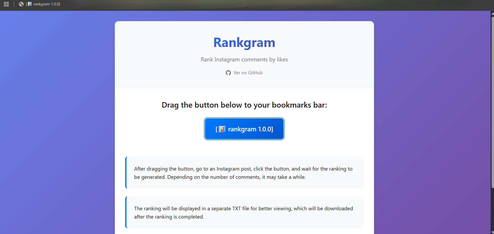

# Rankgram

**Rankgram** is a simple bookmarklet that ranks Instagram post comments by user and number of unique comments. It helps you generate a TXT ranking list of the users who commented the most on any Instagram post, making it ideal for social engagement campaigns, contests, or giveaways.



---

## Features

* 📊 **Ranks all commenters** on any Instagram post
* 🧹 **Counts only unique comments** per user
* ⏳ **Works with any number of comments** (from 10 to 10,000+)
* 🗃️ **Exports the ranking to a TXT file** for easy sharing or record-keeping
* 🔒 **Runs fully client-side** (no data leaves your browser)
* ⚡ **Easy to use, just drag the button to your bookmarks bar**

---

## How It Works

* You drag the bookmarklet button to your bookmarks bar.
* Open any Instagram post (while logged in).
* Click the bookmarklet to start.
* The tool automatically scrolls and collects all comments.
* When finished, a `.txt` file with the ranking will be downloaded.

---

## Getting Started (Run Locally)

If you want to build, customize, or improve this tool locally, follow these steps:

### 1. **Clone the Repository**

```bash
git clone https://github.com/willy-r/rankgram.git
cd rankgram
```

### 2. **Install Dependencies**

You only need Node.js (for building) and `uglify-js` (for minification):

```bash
npm install -g uglify-js
```

### 3. **Build the Project**

Run the provided shell script to minify the bookmarklet and generate the HTML:

```bash
bash minifier.sh
```

This will:

* Minify `rank-comments.js` into `rank-comments.min.js`
* Generate `index.html` with the bookmarklet embedded

### 4. **Open the App**

Open `index.html` in your browser to use the tool or to test any style/UI changes.

---

## Usage

1. **Open `index.html` in your browser.**
2. **Drag the `[📊 rankgram 1.0.0]` button** to your bookmarks bar.
3. **Go to any Instagram post** (while logged in).
4. **Click the bookmarklet** and wait while it collects comments (progress shown).
5. The ranking will be generated and downloaded as a `.txt` file.

---

## How to Contribute

**Want to help improve Rankgram? Contributions are welcome!**

1. **Fork this repository**
2. **Create a new branch** for your feature or fix:
   `git checkout -b feature/your-feature`
3. **Make your changes**
4. **Build and test locally** (`bash minifier.sh` then open `index.html`)
5. **Submit a Pull Request** with a clear description

### Suggestions

* Improve performance for large posts
* Support more comment types/media
* Add options for CSV export
* Improve UI/UX of the index page

---

## License

MIT License.
Use at your own risk. Not affiliated with Instagram.

---

## Credits

Made with 💙 by [willy-r](https://github.com/willy-r).

---

## Disclaimer

* This tool requires you to be logged in to Instagram.
* It works only on **Instagram post pages** (`https://www.instagram.com/p/...`).
* Instagram UI changes may break this tool. Please report any issues via GitHub!

---

**Enjoy using Rankgram!**
